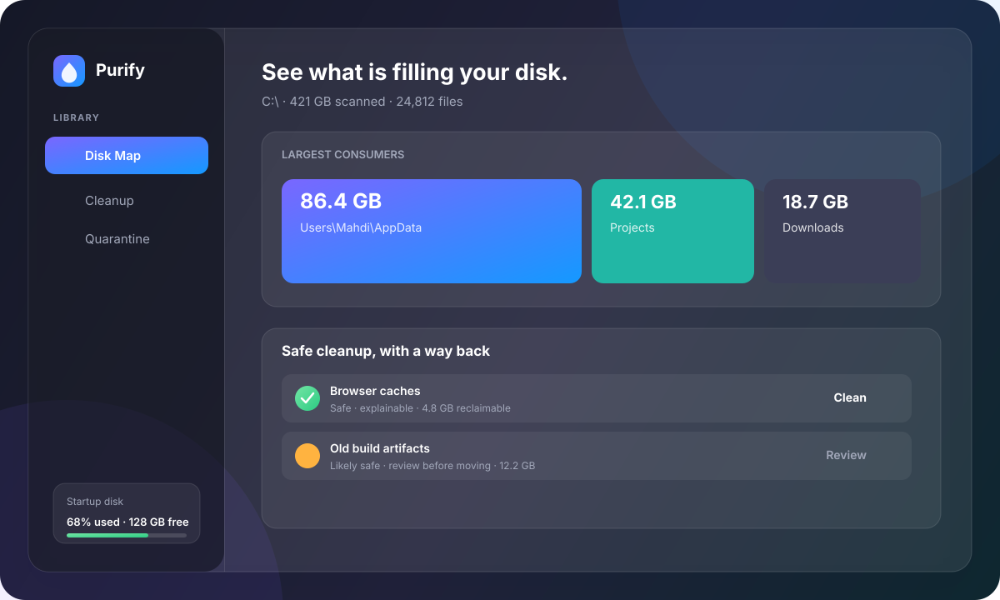

<div align="center">
  
  <h1>Purify</h1>
  <p><strong>Clean your Windows disk without second-guessing what is safe.</strong></p>
  <p>Fast, private and reversible disk cleanup for Windows — built with Rust and Tauri.</p>

  <p>
    <a href="https://github.com/Mahdi-mortazavi/purify/releases/latest"><strong>Download for Windows</strong></a>
    · <a href="#how-it-works">See how it works</a>
    · <a href="README.fa.md">فارسی</a>
    · <a href="https://github.com/Mahdi-mortazavi/purify/issues/new?template=bug_report.yml">Report a bug</a>
    · <a href="CONTRIBUTING.md">Contribute</a>
  </p>

  <p>
    <a href="https://github.com/Mahdi-mortazavi/purify/actions/workflows/ci.yml"></a>
    <a href="https://github.com/Mahdi-mortazavi/purify/releases/latest"></a>
    <a href="LICENSE"></a>
    <a href="https://github.com/Mahdi-mortazavi/purify/issues"></a>
  </p>
</div>

<br />

<div align="center">
  
</div>

## The problem is not finding files. It is knowing what to trust.

When a Windows drive fills up, one tool shows a maze of folders and another asks you to delete blindly. Purify gives you a calmer path: **understand the space, review the reason, then clean with a way back.**

<a id="how-it-works"></a>
## How it works

| 01 · Understand | 02 · Decide | 03 · Undo |
| --- | --- | --- |
| Scan a drive and see the largest consumers at a glance. | Get explainable suggestions with a confidence level: Safe, Likely safe, or Review needed. | Approved items move to a local quarantine. Restore them whenever you want; permanent purge is explicit. |

## What you get

- **Disk Map** — a fast treemap of the space that matters, using a direct NTFS/MFT reader when elevated and a portable parallel walker otherwise.
- **Safe Cleanup** — 30+ built-in signatures for caches, leftovers and developer clutter, each with a plain-language reason.
- **Quarantine** — cleanup is reversible by default. There is no silent delete and no “are you sure?” theatre after the fact.
- **Organizer** — preview and sort loose files in Downloads with one-command undo.
- **Disk Guardian** — see storage pressure before it becomes an emergency.
- **Private by design** — offline, no telemetry, no registry edits, and no network dependency in the core product.

## Why Purify?

| | Traditional folder viewers | One-click cleaners | **Purify** |
| --- | --- | --- | --- |
| Understand where space goes | Partial | Rarely | **Disk map + largest consumers** |
| Explain what can be removed | No | Sometimes | **Reason + confidence on every suggestion** |
| Recover after cleanup | Manual | Usually no | **Local quarantine + restore** |
| Work offline | Yes | Varies | **Yes, by design** |
| Built for developers | No | No | **CLI, rules in TOML, Rust workspace** |

## Start in 60 seconds

1. Download the latest [Windows release](https://github.com/Mahdi-mortazavi/purify/releases/latest).
2. Open Purify and choose a drive or folder.
3. Press **Scan** to understand the space, then **Analyze** for suggestions.
4. Review the reason and confidence. Press **Clean** to move approved items to quarantine.

> Nothing is deleted by default. You stay in control at every step.

### Scriptable mode

The CLI is useful for read-only checks, automation and CI diagnostics:

```powershell
purify scan C:\ --top 20
purify analyze C:\Users\me
purify clean C:\Users\me                 # preview only
purify clean C:\Users\me --apply         # reversible quarantine
purify restore <id>
```

## Built for speed, designed for restraint

With administrator rights, Purify reads the NTFS Master File Table directly instead of walking every file. Without admin it uses a parallel walker. Matching is compiled once, paths are normalized once, and directory sizes are computed only when needed.

On a representative 7,400-file profile, release builds measured roughly **20 ms for `scan`** and **28 ms for `analyze`**. Results depend on the drive and hardware; the benchmark method lives in [`ARCHITECTURE.md`](ARCHITECTURE.md).

## A small workspace with clear boundaries

| Area | Responsibility |
| --- | --- |
| `purify-core` | Rules, suggestions, quarantine, organizer and guardian; safe Rust only |
| `purify-ntfs` | The only crate with raw volume/MFT access |
| `purify-cli` | Scriptable command-line interface |
| `purify-desktop` | Tauri 2 desktop experience |
| `knowledge-base/` | Community-editable cleanup signatures |

```powershell
git clone https://github.com/Mahdi-mortazavi/purify.git
cd purify
cargo test --workspace
cargo fmt --all --check
cargo clippy --workspace --all-targets -- -D warnings
```

CI runs formatting, Clippy, unit and integration tests, desktop builds on Windows and Ubuntu, and dependency-policy checks on every pull request.

## Contribute to the trust layer

You do not need to be a Rust expert to make Purify better. A cleanup signature in `knowledge-base/` is a valuable contribution when it clearly states what it targets, why it is safe, and how it is tested.

1. Read [`CONTRIBUTING.md`](CONTRIBUTING.md) and [`ARCHITECTURE.md`](ARCHITECTURE.md).
2. Pick an issue labelled [`good first issue`](https://github.com/Mahdi-mortazavi/purify/issues?q=is%3Aissue+is%3Aopen+label%3A%22good+first+issue%22) or propose a focused improvement.
3. Keep the safety boundary explicit and include a reproducible test when behaviour changes.

Bug reports and UX feedback are welcome in [Issues](https://github.com/Mahdi-mortazavi/purify/issues). Please include your Windows version, whether the app was elevated, the command or screen involved, and a safe reproduction path.

## Roadmap

- More Windows-safe signatures with better explanations
- Signed MSIX / Winget distribution
- Accessibility and keyboard-first polish across the desktop UI
- A lightweight review history for every cleanup run

## Project links

- [Releases](https://github.com/Mahdi-mortazavi/purify/releases) · [Issues](https://github.com/Mahdi-mortazavi/purify/issues) · [Discussions](https://github.com/Mahdi-mortazavi/purify/discussions)
- [Architecture](ARCHITECTURE.md) · [Contributing](CONTRIBUTING.md) · [Security](SECURITY.md)
- فارسی: [`README.fa.md`](README.fa.md)

## License

MIT © Mahdi Mortazavi. See [`LICENSE`](LICENSE).
